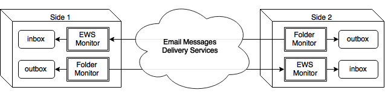

git-exchange Project
====================

The main purpose of this project is to build more or less convenient data
bridge between dedicated folders on 2 computers that are separated by very
strict firewall and users are limited by corporate policy that doesn't allow
any kind of connection with outer world except Email.

The Short Explanation
---------------------

The implementation of this idea in this project is quite specific b/c of
initial conditions:

* Both sides use MS Exchange (EWS) server as Email transport (b/c such ).
  It means that both sides may use either the same EWS server or different
  ones, but EWS.
* EWS on both computers allows attachments but scans them and cut them off in
  case if they contain "prohibited" media content, though this filter allows
  non-detectable (encrypted) attachments.
* Only files (not sub-folders) are synchronized between computers. That's 
  considered as by design limitation, b/c application's `inbox` and `outbox`
  purpose is to temporarily keep VCS (Git) patches or bundles that in fact is
  plain list, so that any kind of file hierarchy support is VCS business. 

The Overall Diagram
-------------------

This application is designed to have at least 2 instances that are run on
different computers. The typical and simplest case is just 2 computers 
("Side 1" and "Side 2" on diagram).
Both sides have symmetric settings and work in absolutely the same manner.

So the main flow may look like that:

1. User of "Side 1" puts file or files into `outbox` folder (these files are
   intended to be the result of Git command - see "Usage" section below for
   details).
2. App on "Side 1" detects that new files are appeared in `outbox` and creates
   new Email message(s) where attaches these files (packed and/or encrypted if
   any).
3. App on "Side 1" sends these Emails to user of "Side 2" that is configured as
   "To" addressee.
4. App on "Side 2" detects that new Email is available, so receives it and
   process to obtain files from attachments and put these files in its original
   form (decrypted and/or unpacked) into `inbox` folder.
5. User of "Side 2" runs appropriate commands (Git) to apply new changes 
   represented by these files, and cleans up the `inbox` folder.

The last point may be automated as well - this feature is in TODO list (see
below).

Build and Run
-------------

### Prerequisites ###

To build and run this application you need:

* Java 7+;
* Maven 3+;
* Internet connection.

### Build ###

This project is Maven-driven, so all what you need to do to build it is run the
following command:

        $ mvn clean package

        
### Run ###
        
If build is successful, you can run the resulting JAR file as standalone Java
app like that:

        $ java -jar target/git-exchange-X.X.X-standalone.jar

Where `X.X.X` is current version number.

The invocation w/o arguments will show an error that proper configuration file
is required. Just in case - you can get the short help about supported command
line argument by specifying `-h` option:

        $ java -jar target/git-exchange-X.X.X-standalone.jar -h

Usage
-----

### Configuration file ###

[TBD]

### Git Email Mode ###

[TBD]

### Git Bundle Mode ###

[TBD]

TODO
----

0. Fix bug when several emails should be processed at once.
0. Add possibility to limit Email size and splitting it to several parts.
0. Add possibility to invoke scripts as new email post-process action.
0. Setup ESW folder for data exchange, extend Config accordingly.
0. Include daemonizing feature - to allow user start, stop and check status of
   service w/o additional complex scripts.
