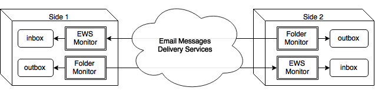

email-bridge Project
====================

The main purpose of this project is to build more or less convenient data
bridge between dedicated folders on 2 computers that are separated by very
strict firewall and where users are limited by corporate policy that doesn't
allow any kind of connection with outer world except Email.
These dedicated folders are designed to keep the intermediate data files that
are in fact the patches or bundles of Git or other VCS system.
This bridge is duplex - so that you can exchange data in both directions.

Contents
--------

1. [The Short Explanation](#the-short-explanation)
2. [How It Works In A Nutshell](#how-it-works-in-a-nutshell)
   1. [The Overall Diagram](#the-overall-diagram)
3. [Build And Run](#build-and-run)
   1. [Prerequisites](#prerequisites)
   2. [Build](#build)
   3. [Run](#run)
   4. [Notices](#notices)
4. [Usage](#usage)
   1. [Configuration file](#configuration-file)
      1. [EWS Settings](#ews-settings)
      2. [Test bridge on one node](#test-bridge-on-one-node)
      3. [Both sides use the same EWS server](#both-sides-use-the-same-ews-server)
      4. [Each side uses its own EWS server](#each-side-uses-its-own-ews-server)
   2. [Git Bundle Mode](#git-bundle-mode)
      1. [Case 1. Existing repo on Side 1 and new empty repo on Side 2
         ](#case-1-existing-repo-on-side-1-and-new-empty-repo-on-side-2)
      2. [Case 2. Changes are committed on Side 1, need to be pushed to Side 2
         ](#case-2-changes-are-committed-on-side-1-need-to-be-pushed-to-side-2)
   3. [Git Email Mode](#git-email-mode)
      1. [Get full patch set from the beginning](#get-full-patch-set-from-the-beginning)
      2. [Get partial patch set from tagged commit](#get-partial-patch-set-from-tagged-commit)
      3. [Restore the patch set](#restore-the-patch-set)
   4. [Post-Receive Script](#post-receive-script)
   5. [Example](#example)
5. [References](#references)
6. [TODO](#todo)

The Short Explanation
---------------------

The implementation of this idea in this project is quite specific b/c of
initial conditions:

* Both sides use MS Exchange (EWS) server as Email transport. It means that
  both sides may use either the same EWS server or different ones, but EWS.
  Although application design allows implementing other mail systems - IMAP,
  POP3 or smth else, where user may upload/attach and download/get files.
* EWS on both computers allows attachments but scans them and cut them off in
  case if they contain "prohibited" media content, though this filter allows
  non-detectable (encrypted) attachments.
* Only files (not sub-folders) are synchronized between computers. That's 
  by design limitation, b/c application's `inbox` and `outbox` purpose is to
  temporarily keep VCS ([Git]) patches or bundles that in fact is plain list, so
  that any kind of file hierarchy support is business of VCS.

How It Works In A Nutshell
--------------------------

When application runs, first of all it scans your EWS inbox
for transport email, matching subject to specific pattern and, if such emails
found, extracts files from their attachments. Then it waits for new messages
and does the same for all new matched emails. All transport emails are removed
automatically.

Just after email Inbox was scanned, application scans its "outbox" folder. If
there are files which names are matched to specific regexp pattern, these files
are gathered as attachments into new email message, and this email message is
sent away with specific subject. Then application waits for new files in
"outbox" folder and does the same for all new files there.

### The Overall Diagram ###

This application is designed to have at least 2 instances that are run on
different computers. The typical and simplest case is just 2 computers 
("Side 1" and "Side 2" on diagram).
Both sides have symmetric settings and work in absolutely the same manner.

So the main flow may look like that:

1. User of "Side 1" puts file or files into `outbox` folder (these files are
   intended to be the result of [Git] command - see the **"Usage"** section below
   for details).
2. App on "Side 1" detects that new files are appeared in `outbox` and creates
   new Email message(s) where attaches these files (packed and/or encrypted if
   configured).
3. App on "Side 1" sends these emails to user of "Side 2" that is configured as
   "To" addressee.
4. App on "Side 2" detects that new email is available, so receives it and
   processes to obtain files from attachments and puts these files into `inbox`
   folder in its original representation (decrypted and/or unpacked).
5. User of "Side 2" runs appropriate commands (e.g. [Git]) to apply new changes 
   represented by these files, and cleans up the `inbox` folder.

The last point may be automated as well - see **"Post-Receive Script"** section
below.

Build And Run
-------------

### Prerequisites ###

To build this application you need:

* JDK 7+;
* [Maven](https://maven.apache.org/) 3+;
* Internet connection.

To run:

* JRE/JDK 7+;
* [Git];
* If OS is Windows - [Cygwin] - optional but recommended.

### Build ###

This project is Maven-driven, so all what you need to do to build it is to run
the following command:

    $ mvn clean package

### Run ###

If build is successful, you can run the resulting JAR file as standalone Java
app like that:

    $ java -jar target/email-bridge-0.1.2-standalone.jar

The invocation w/o arguments will show an error that proper configuration file
is required. Just in case - you can get the short help about supported command
line arguments by specifying `-h` option:

    $ java -jar target/email-bridge-0.1.2-standalone.jar -h

### Notices ###

All command line examples in this document are written in Bash notation, so for
Windows users the [Cygwin] installation is highly recommended. That will help
you to unify all commands and scripts you may use on different platforms.

On some Windows hosts (supposedly virtual) in case if application is ran from
[Cygwin] it works, but very slow - looks like there are some flaws in Cygwin
Java threads management.  
So, if you stuck with it - just run application in `cmd.exe` tool instead.

Usage
-----

### Configuration file ###

The application requires a valid configuration file for run.

This configuration file is simple key-value properties enclosed into text file.
The self-explained configuration file template 
[`config-template.properties`](data/config-template.properties) you may find in
`data` folder. So the usual command to run app should look like that:
 
    $ java -jar target/email-bridge-X.X.X-standalone.jar -f config.properties

#### EWS Settings

First of all you have to define the credentials for your Exchange server.
At least `ews.email`, `ews.username` and `ews.password` should be defined.
Also `ews.server` is recommended to define, because otherwise auto-discovery
functionality will be engaged that will slow a lot the connection phase. 

Very often `ews.username` is the same as `ews.email`, so if you aren't sure
what is your username, just put your email address here.

The `ews.domain` property should be specified only in case if it wasn't 
auto-detected by application and issued exception explicitly requires it. 

#### Test bridge on one node

This test is recommended to perform when you define settings for node. This
will help you to make sure that your node is fully functioning and ready to
exchange data with remote side.

1. First of all, set `email.tag.incoming` and `email.tag.outgoing` properties
   to the same value.
2. Then copy `ews.email` address to `email.recipients.to`.

That's it. Now your node will send files via your exchange server to itself.
So that when you start app, and drop files into folder that you defined in
`outbox.folder` property, after some time you will get them in folder defined
in `inbox.folder`.

If you have it, move forward and decide what mode of file exchange is most
appropriate for you:

* If you have access to the same EWS server from both sides, use **"Both sides
  use the same EWS server"** mode. That will speedup file delivery because
  server will know about new email instantly, w/o intermediate email routing.
* In case if your nodes have access to different EWS servers, the **"Each side
  uses its own EWS server"** is your choice.

#### Both sides use the same EWS server

Both sides (nodes) should use the same configuration file, except following.

The `email.tag.incoming` and `email.tag.outgoing` properties should be
different. So that if e.g. **Side 1** has properties:
   
    email.tag.incoming = git-ews-forth
    email.tag.outgoing = git-ews-back
     
then **Side 2** should have these properties as

    email.tag.incoming = git-ews-back
    email.tag.outgoing = git-ews-forth

That separates 2 head email streams on one server and allows each node to deal
with its own email stream independently.

And, of course, `ews.email` and `email.recipients.to` properties on these nodes
should be "crossed":

e.g. if **Side 1**:

    ews.email = user1@side1.example.com
    email.recipients.to = user2@side2.example.com

then **Side 2**:

    ews.email = user2@side2.example.com
    email.recipients.to = user1@side1.example.com

#### Each side uses its own EWS server

Each side should have its own set of `ews.*` properties and probably `proxy.*`
ones. Rest of properties should be the same, except `ews.email` and
`email.recipients.to` - they should be "crossed" as described above.

### Git Bundle Mode ###

This mode is about using [git-bundle] command. This is recommended mode, b/c
it allows to keep 2 directories as compatible as possible.

In case if you select to use Git bundles to transfer changes from one side to
another you may turn off the application attachment zipping feature, because
Git bundles are packed already. Just specify `email.attach.gzip = false` in
your configuration file. Though, if you don't - it should work w/o problems.

Below are most typical cases you may deal with.

#### Case 1. Existing repo on Side 1 and new empty repo on Side 2

It is initial phase of data exchange. You have to have the following:

1. Existing Git repo on Side 1, where you have some commits already. It's not
   important whether your repo has remote origin or not.
2. Empty (or non-empty - then conflict resolving is possible) Git repo on
   Side 2. Remote origin isn't important here as well.

**Side 1:**

    $ # Go to the Git-driven project folder
    $ cd "$HOME/workspace/email-bridge"
    
    $ # Create the full project bundle from master branch
    $ # and drop it into outbox folder of your email-bridge app
    $ # File name will be in form email-bridge-<40_hex_digits_git_hash>.bundle
    $ git bundle create "$OUTBOX_FOLDER/email-bridge-`git rev-parse HEAD`.bundle" master
    
    $ # Tag the current state of your Git repo to simplify
    $ # the further incremental bundle changes gathering.
    $ # Use tag name you like.
    $ git tag -f git-email-bridge 

After some time, when email-bridge transferred bundle from Side 1 to Side 2,
go to the Side 2 host.

**Side 2:**

    $ # Go to the Git-driven project folder
    $ cd "$HOME/workspace/email-bridge"
    
    $ # Load received bundle content into FETCH_HEAD branch
    $ git fetch $INBOX_FOLDER/email-bridge-<40_hex_digits_git_hash>.bundle master
    
    $ # Merge FETCH_HEAD into current branch
    $ git merge FETCH_HEAD
    
    $ # Tag the current state of your Git repo to simplify
    $ # the further incremental bundle changes gathering.
    $ # Use tag name you like.
    $ git tag -f git-email-bridge 

    $ # Remove imported bundle
    $ rm $INBOX_FOLDER/email-bridge-<40_hex_digits_git_hash>.bundle

Now you can do `git push` if your repo has remote origin defined.

Sometimes new empty Git repo is created with initial commit, that provokes
the merge commit. This commit should be returned to source repository.
If you stuck with it, then simple send this commit back to the source side (to
Side 1 in our example). Short command set for that:

**Side 2:**

    $ git bundle create "$OUTBOX_FOLDER/email-bridge-`git rev-parse HEAD`.bundle" HEAD^..master

**Side 1:**

    $ git fetch $INBOX_FOLDER/email-bridge-<40_hex_digits_git_hash>.bundle master
    $ git merge FETCH_HEAD
    $ git tag -f git-email-bridge 
    $ rm $INBOX_FOLDER/email-bridge-<40_hex_digits_git_hash>.bundle

#### Case 2. Changes are committed on Side 1, need to be pushed to Side 2

This is typical iterated phase when you did part of work and want to transfer
your changes to remote side.
The set of commands is completely the same for both directions, so lets suppose
your changes should be transferred from Side 1 repo to Side 2 one.

**Side 1:**

    $ # Go to the Git-driven project folder
    $ cd "$HOME/workspace/email-bridge"

    $ # Create the incremental bundle from master branch
    $ # and drop it into outbox folder of your email-bridge app
    $ git bundle create "$OUTBOX_FOLDER/email-bridge-`git rev-parse HEAD`.bundle" git-email-bridge..master
    
    $ # Move tag to the current state of your Git repo
    $ # for further incremental bundle changes gathering.
    $ # Use tag name you used before.
    $ git tag -f git-email-bridge 

After some time, when email-bridge transferred bundle from Side 1 to Side 2,
go to the Side 2 host.

**Side 2:**

    $ # Go to the Git-driven project folder
    $ cd "$HOME/workspace/email-bridge"
    
    $ # Load received bundle content into FETCH_HEAD branch
    $ git fetch $INBOX_FOLDER/email-bridge-<40_hex_digits_git_hash>.bundle master
    
    $ # Merge FETCH_HEAD into current branch
    $ git merge FETCH_HEAD
    
    $ # Tag the current state of your Git repo
    $ # for further incremental bundle changes gathering.
    $ # Use tag name you used before.
    $ git tag -f git-email-bridge 

    $ # Remove imported bundle
    $ rm $INBOX_FOLDER/email-bridge-<40_hex_digits_git_hash>.bundle

Now you can do `git push` if your repo has remote origin defined.

### Git Email Mode ###

The alternative method to get and restore changes is to use [git-format-patch]
and [git-am] commands respectively. You may find them usable in case if:

* You have to synchronize data between repositories that have different nature,
  e.g. Git <=> SVN <=> Hg <=> Perforce etc.
* Git bundle that encloses all commits into one file may be too big for one
  email message, especially when you move the big project initially, so that
  splitting it to multiple patch files will simplify to transfer it by multiple
  emails. (Though, this issue was resolved by adding gathered attachments into
  solid package and splitting this package to several parts).

The approach of getting and restore data is almost the same as in previous
section, except key Git commands and file format.

For this mode is important to pack patch files, b/c they are in plain text
format. To do that just set `email.attach.gzip = true` in configuration file.

#### Get full patch set from the beginning

Let's start from the case when you need to make the initial project transfer
so that you have to get all the commits from the project beginning.

**Side 1:**

    $ # Go to the Git-driven project folder
    $ cd "$HOME/workspace/email-bridge"
    
    $ # Create the full patch set of current project branch
    $ # and drop it into outbox folder of your email-bridge app.
    $ # File names will be in form NNNN-<first-line-in-commit-message>.patch
    $ # where NNNN - 4-digit index of patch in this patch set
    $ git format-patch --root -o "$OUTBOX_FOLDER" origin

    $ # Tag the current state of your Git repo to simplify
    $ # the further incremental bundle changes gathering.
    $ # Use tag name you like.
    $ git tag -f git-email-bridge 

#### Get partial patch set from tagged commit

That's the same as before, but you have to move just part of work that is ready
to be transferred after several commits.

**Side 1:**

    $ # Go to the Git-driven project folder
    $ cd "$HOME/workspace/email-bridge"
    
    $ # Create the partial patch set of current project branch
    $ # and drop it into outbox folder of your email-bridge app.
    $ git format-patch --root -o "$OUTBOX_FOLDER" git-email-bridge..master

    $ # Tag the current state of your Git repo to simplify
    $ # the further incremental bundle changes gathering.
    $ # Use tag name you used before.
    $ git tag -f git-email-bridge 

#### Restore the patch set

When you receive the patch set, and files were successfully created on
acceptor's side, you have to apply them into your target repo.
 
**Side 2:**

    $ # Go to the Git-driven project folder
    $ cd "$HOME/workspace/email-bridge"
    
    $ # Iterate through file patches, apply them into current branch
    $ # and finally remove the applied patch file.
    $ # for file in `ls -1 "$INBOX_FOLDER/*.patch"`; do git am $file; rm $file; done
    
    $ # Tag the current state of your Git repo
    $ # for further incremental bundle changes gathering.
    $ # Use tag name you used before.
    $ git tag -f git-email-bridge 

You may see set of warning messages about patch format, but if it isn't an
errors you may don't care about them.

### Post-Receive Script ###

If your actions right after you receive new files into `inbox` folder are the
same and you want to perform them each time, then you can put them into script
file that will be launched every time you have new data.

Path to such script file (or any other executable) should be specified in
`inbox.script` configuration property.   
Positional arguments of this script are received file names (w/o paths) in
order they were received and extracted from email attachments.
Environment variables are system ones plus values from configuration file,
which names are property names that are upper-cased and dot-to-underscore
replaced, so that e.g. property with name `inbox.script` will be represented as
environment variable with name `INBOX_SCRIPT`.

You can find demo script [`inbox-demo.sh`](data/inbox-demo.sh) in `data`
folder. This script does nothing, just prints some info into application log.

For example in **"Case 2. Changes are committed on Side 1, need to be pushed to
Side 2"** above such script may be written as:

    #!/usr/bin/env bash
    
    cd "$HOME/workspace/email-bridge"
    
    for file; do
    	git fetch "$INBOX_FOLDER/$file" master
    	git merge FETCH_HEAD
    	rm "$INBOX_FOLDER/$file"
    done
    
    git tag -f git-email-bridge
    git push
    
    exit 0

Of course it is valid only for simple cases, when you have fast-forward commits
only - no conflict resolving, no error handling, etc.
Also, order of incoming files is important and you cannot apply the same bundle
twice to the same branch.

### Example ###

There is [set of scripts](data/example) that was setup to synchronize this repository.
To correctly launch the app from there, just do the following:

1. Build application using command `mvn clean package`
2. Go to `data/example` folder and copy `config.properties` into `config-settings.properties`
   to prevent your private setting to be committed into Git.
3. Change `config-settings.properties` according your EWS credentials. 
   The following keys should be changed:
   * `ews.email`
   * `ews.domain`
   * `ews.username`
   * `ews.password`
   * `email.recipients.to`
   * `email.attach.password` (optional, but recommended)
4. Run email-bridge with the command: `CFG_FILE=config-settings.properties ./run.sh start` 
   don't specify full path for `CFG_FILE`, b/c script looks for it relatively itself.

If you see the success message the application was launched and runs in the background.
You may inspect log in `data/example/app.log` file.

To check if application is running, use command `./run.sh status`.

To stop application: `./run.sh stop`; to restart: `./run.sh restart`.

References
----------

1. [EWS Java API][ews-java-api]
2. [Move objects and refs by archive][git-bundle]
3. [Prepare patches for e-mail submission][git-format-patch]
4. [Apply a series of patches from a mailbox][git-am]
5. [Cygwin Project][Cygwin]
6. [Git VCS][Git]

[ews-java-api]: https://github.com/OfficeDev/ews-java-api
[git-bundle]: http://git-scm.com/docs/git-bundle
[git-format-patch]: http://git-scm.com/docs/git-format-patch
[git-am]: http://git-scm.com/docs/git-am
[Cygwin]: http://cygwin.org/
[Git]: https://git-scm.com/downloads

TODO
----

0. Fix bug if inbox folder isn't exist - it should be tried to create.
0. Re-factor code to operate only with ZIP archives/volumes as transport attachments.
0. Add setting to delete emails into Trash folder instead of hard remove.
0. Add additional filtering emails by sender.
0. Setup ESW folder for data exchange, extend Config accordingly.
0. Include daemonizing feature - to allow user start, stop and check status of
   service w/o additional complex scripts.
